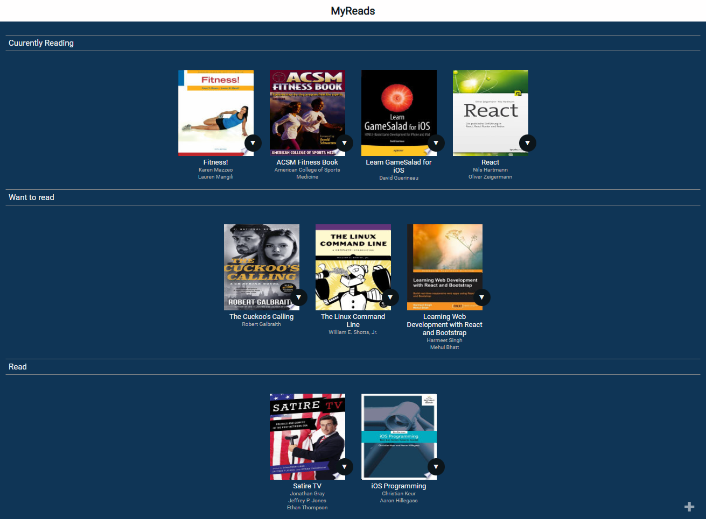
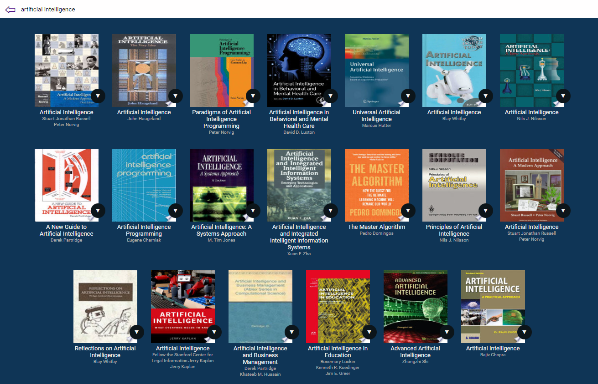

# MyReads:- Book Tracking app

## Table of contents

- [Overview](#overview)
  - [About](#about)
  - [Links](#links)
  -[Screenshots](#screenshots)
- [My process](#my-process)
  - [Built with](#built-with)
-[Installation](#installation)
  - [Important](#important)

## Overview

### About

📚 Book Tracker Project:
Introducing my latest project - a Book Tracker that empowers you to organize and categorize your reading journey! Whether you're an avid bookworm, a casual reader, or just starting your literary adventure, this tool is designed to help you keep track of the books you've read, are currently reading, or aspire to read in the future.

🔍 Key Features:

Categorization: Easily categorize your books into "Read," "Currently Reading," or "Want to Read" shelves for better organization.
Book Details: Access comprehensive details about each book, including title, author, cover image, synopsis, and publication information.
Personal Notes: Add personal notes, thoughts, or reviews to remember your impressions of each book.
Search and Filter: Quickly find books by title, author, or genre using the search and filter functionalities.
User-Friendly Interface: Enjoy a clean and intuitive user interface that makes managing your book collection a breeze.

### Links

- Live Site URL: [https://my-reads-book-tracking.vercel.app/](https://my-reads-book-tracking.vercel.app/)

### Screenshots

## My process

I created the app from scratch with `create-react-app` and i divided the app to components and two views and each view have specific components functionality, the app communicate with a Backend Server from Udacity for book information and long term storage.

### Built with

- Semantic HTML5 markup
- CSS custom properties
- Flexbox
- [React](https://reactjs.org/) - JS library

### Backend Server

The provided file `BooksAPI.js` contains following methods to perform necessary operations on the backend:

- `getAll()` for getting all your books.
- `update()` for updating shelf.
- `search()` for searching books while typing in input field.
- `get()` for getting book details

## Installation

Clone the repository, and install dependencies using NPM and start local host

- clone the repo `git clone https://github.com/mohamedhesham221/MyReads-book-tracking`
- install dependencies `npm install`
- start project with `npm start`
- it can be viewed in the browser at `http://localhost:3000`

### Important

The backend API is built by Udacity and only a fixed set of search terms are supported. Supported search terms can be found in [SEARCH_TERMS.md](https://github.com/THEPEACEMAKER/myReads-book-tracking-app/blob/master/SEARCH_TERMS.md)That list of terms are the only terms that will work with the API.
